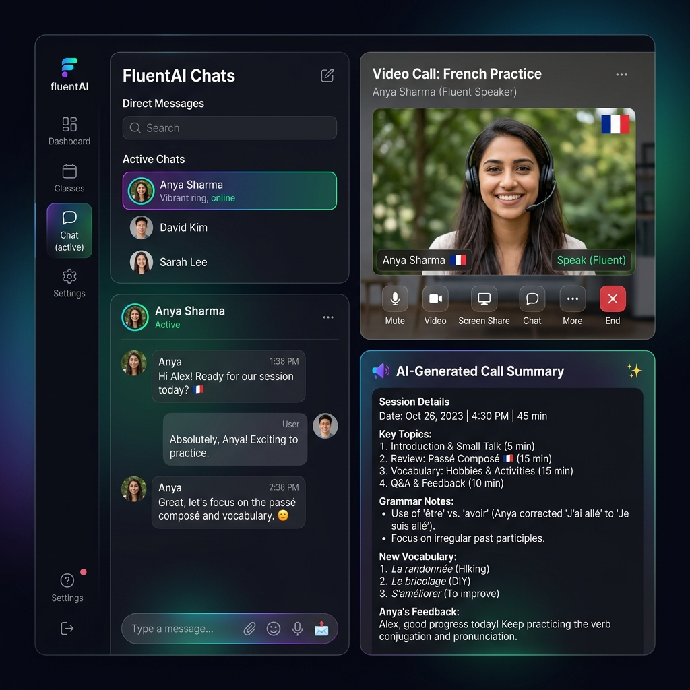

<div align="center">
  
  
  <br/>

  # 🗣️ Lets-Chat: The Ultimate MERN Stack App
  
  **A premium, high-performance messaging and language learning platform.**
  
  *Integrated with Google Gemini AI for intelligent summaries and Stream SDK for real-time messaging & video calls.*

  <br />

  [](https://reactjs.org/)
  [](https://nodejs.org/)
  [](https://www.mongodb.com/)
  [](https://tailwindcss.com/)
  [](https://getstream.io/)
  [](https://deepmind.google/technologies/gemini/)
</div>

---

## ✨ God-Level Features

- **📽️ Advanced Video Calls:** High-quality video communication powered by Stream Video SDK.
- **📝 Live Transcription:** Real-time text transcription of everything spoken during a video call.
- **🤖 AI Call Summarization:** Get a professional AI-generated summary of your video calls using Google Gemini.
- **🎥 Cloud Recordings:** Automatically record your calls, watch/download them, or delete them for privacy.
- **🚀 Real-time Messaging:** Blazing fast chat powered by Stream Chat SDK.
- **🌍 Language Learning Focus:** Onboarding flow with native and learning language selection (with live flags!).
- **👥 Friends System:** Dedicated friends page to manage connections and discover new learners.
- **🔐 Secure Authentication:** Robust user auth using JWT, Bcrypt, and Cookie-based sessions.
- **🌈 Modern UI/UX:** Sleek design with React, Tailwind CSS, and DaisyUI.
- **🌓 Theme Switching:** 30+ customizable themes for a personalized experience.

---

## 🛠️ Tech Stack

### Frontend 🎨
- **Framework:** React 19 (Vite)
- **Styling:** Tailwind CSS & DaisyUI
- **State Management:** Zustand
- **Data Fetching:** TanStack Query (React Query)
- **Animations:** Framer Motion
- **Communication SDKs:** Stream Chat & Stream Video

### Backend ⚙️
- **Runtime:** Node.js
- **Framework:** Express.js
- **Database:** MongoDB (Mongoose)
- **AI Integration:** Google Generative AI (Gemini 1.5 Flash)
- **Security:** JWT & BcryptJS

---

## 🚀 Getting Started

Follow these simple steps to get your local environment set up within minutes!

### 📋 Prerequisites
Make sure you have the following installed and set up:
- **Node.js** (v18 or higher)
- **MongoDB** (Local or Atlas)
- **Stream Dashboard Account** (for Chat & Video API keys)
- **Google AI Studio** (for Gemini API Key)

### ⚙️ Environment Variables

**1. Backend (`backend/.env`)**
Create a `.env` file in the `backend/` directory:
```env
PORT=5001
MONGO_URL=your_mongodb_connection_string
JWT_SECRET=your_super_secret_key
STREAM_API_KEY=your_stream_api_key
STREAM_API_SECRET=your_stream_api_secret
GEMINI_API_KEY=your_gemini_api_key
NODE_ENV=development
```

**2. Frontend (`fronted/.env`)**
Create a `.env` file in the `fronted/` directory:
```env
VITE_STREAM_API_KEY=your_stream_api_key
```

---

## 🛠️ Installation & Setup

**1. Clone the repository**
```bash
git clone https://github.com/your-username/Lets-Chat.git
cd Lets-Chat
```

**2. Backend Setup**
```bash
cd backend
npm install
npm run dev
```

**3. Frontend Setup**
Open a new terminal window:
```bash
cd fronted
npm install
npm run dev
```

---

## 📂 Project Structure

A clean, modular architecture makes extending the app a breeze!

```text
├── backend/
│   ├── src/
│   │   ├── controllers/  # API Logic (Auth, User, AI)
│   │   ├── models/       # Mongoose Schemas (User, FriendRequest)
│   │   ├── routes/       # API Endpoints
│   │   ├── middleware/   # Auth Protection
│   │   └── server.js     # Entry point
├── fronted/
│   ├── src/
│   │   ├── components/   # UI Library & Layouts
│   │   ├── pages/        # CallPage, ChatPage, FriendsPage, etc.
│   │   ├── store/        # Zustand Theme Store
│   │   ├── hooks/        # Custom React Hooks
│   │   └── lib/          # API & SDK Clients
```

---

## 🤝 Contributing & License

- **Contributing:** Feel free to fork this project and submit PRs. Let's make communication smarter together! 🚀
- **License:** This project is licensed under the **ISC License**.

<br />

<div align="center">
  <p><b>Made with ❤️ for the Modern Web</b></p>
  
</div>
